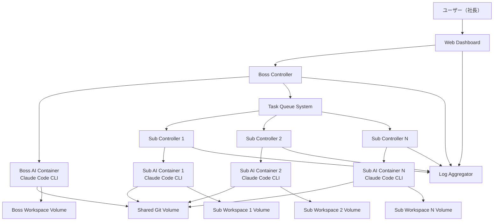

# Design Document

## Overview

Claude Company Systemは、WindowsホストのDocker環境上でLinuxコンテナを使用して動作する階層型AI開発システムです。各LinuxコンテナでClaude Code CLIを実行し、上司AI、部下AI、キューシステム、Webダッシュボードが連携してプロジェクト開発を自動化します。

## Architecture

### System Architecture Diagram



### Container Architecture

1. **Web Dashboard Container**
   - React.js + TypeScript フロントエンド
   - WebSocket接続でリアルタイム更新
   - ユーザー指示入力インターフェース

2. **Boss AI Container**
   - Ubuntu 22.04 LTS ベース
   - Claude Code CLI インストール済み
   - Node.js 20 LTS + 制御スクリプト
   - Python 3.11 + 制御スクリプト
   - タスク分解・割り振りロジック
   - 結合テスト実行環境
   - MCP (Model Context Protocol) 対応

3. **Subordinate AI Container(s)**
   - Ubuntu 22.04 LTS ベース
   - Claude Code CLI インストール済み
   - Node.js 20 LTS + 制御スクリプト
   - Python 3.11 + 制御スクリプト
   - 単体テスト実行環境
   - 開発ツール（Node.js, Python, Go等）

4. **Task Queue System**
   - Redis 7 + Bull Queue (Node.js)
   - タスクの優先度管理
   - 依存関係解決

5. **Shared Git Volume**
   - Docker Volume として共有
   - 各コンテナからマウント
   - 自動コミット・ブランチ管理

6. **Log Aggregator**
   - Fluent Bit + Elasticsearch + Kibana
   - リアルタイムログ収集・表示

## Components and Interfaces

### 1. Web Dashboard Component

**技術スタック:**
- Frontend: React 18 + TypeScript + Vite
- Styling: Tailwind CSS v3 + Headless UI
- WebSocket: Socket.io-client
- Charts: Chart.js + react-chartjs-2
- Icons: Heroicons + Lucide React
- State Management: Zustand
- Animations: Framer Motion
- Code Highlighting: Prism.js

**主要機能:**
- レスポンシブ対応の進捗監視ダッシュボード
- リアルタイムAIエージェント状況表示
- インタラクティブなログビューア
- 視覚的なプロジェクト進捗表示
- ダークモード対応

**UI Components Design:**

```typescript
// メインダッシュボードレイアウト
interface DashboardLayout {
  header: HeaderComponent;           // ナビゲーション + ダークモード切り替え
  sidebar: SidebarComponent;         // プロジェクト一覧 + フィルター
  mainContent: MainContentComponent; // 進捗表示エリア
  footer: FooterComponent;           // ステータスバー
}

// AIエージェントステータスカード
interface AgentStatusCard {
  agentId: string;
  agentType: 'boss' | 'subordinate';
  status: 'idle' | 'working' | 'error';
  currentTask?: string;
  progress: number;
  executionTime: number;
  lastActivity: Date;
  performanceMetrics: {
    tasksCompleted: number;
    averageExecutionTime: number;
    successRate: number;
  };
}

// プログレスダッシュボード
interface ProgressDashboard {
  overallProgress: {
    completedTasks: number;
    totalTasks: number;
    estimatedCompletion: Date;
  };
  taskTimeline: TimelineItem[];
  performanceCharts: ChartData[];
  recentActivity: ActivityItem[];
}

// ログビューア
interface LogViewer {
  logs: LogEntry[];
  filters: {
    level: LogLevel[];
    agentId: string[];
    timeRange: DateRange;
  };
  searchQuery: string;
  syntaxHighlighting: boolean;
  autoScroll: boolean;
}
```

**Tailwind CSS Design System:**

```typescript
// カラーパレット
const colorScheme = {
  primary: {
    50: 'bg-blue-50',
    500: 'bg-blue-500',
    600: 'bg-blue-600',
    700: 'bg-blue-700'
  },
  success: {
    50: 'bg-green-50',
    500: 'bg-green-500',
    600: 'bg-green-600'
  },
  warning: {
    50: 'bg-yellow-50',
    500: 'bg-yellow-500',
    600: 'bg-yellow-600'
  },
  error: {
    50: 'bg-red-50',
    500: 'bg-red-500',
    600: 'bg-red-600'
  },
  neutral: {
    50: 'bg-gray-50',
    100: 'bg-gray-100',
    200: 'bg-gray-200',
    800: 'bg-gray-800',
    900: 'bg-gray-900'
  }
};

// レスポンシブブレークポイント
const breakpoints = {
  sm: '640px',   // モバイル
  md: '768px',   // タブレット
  lg: '1024px',  // デスクトップ
  xl: '1280px',  // 大画面
  '2xl': '1536px' // 超大画面
};

// コンポーネントスタイル
const componentStyles = {
  card: 'bg-white dark:bg-gray-800 rounded-lg shadow-md border border-gray-200 dark:border-gray-700 p-6',
  button: {
    primary: 'bg-blue-600 hover:bg-blue-700 text-white font-medium py-2 px-4 rounded-md transition-colors duration-200',
    secondary: 'bg-gray-200 hover:bg-gray-300 dark:bg-gray-700 dark:hover:bg-gray-600 text-gray-900 dark:text-gray-100 font-medium py-2 px-4 rounded-md transition-colors duration-200'
  },
  badge: {
    success: 'bg-green-100 text-green-800 dark:bg-green-900 dark:text-green-200 px-2 py-1 rounded-full text-xs font-medium',
    warning: 'bg-yellow-100 text-yellow-800 dark:bg-yellow-900 dark:text-yellow-200 px-2 py-1 rounded-full text-xs font-medium',
    error: 'bg-red-100 text-red-800 dark:bg-red-900 dark:text-red-200 px-2 py-1 rounded-full text-xs font-medium'
  }
};
```

**API Endpoints:**
```typescript
interface DashboardAPI {
  // ユーザー指示送信
  POST /api/instructions
  
  // AIエージェント状況取得
  GET /api/agents/status
  
  // 詳細エージェント情報取得
  GET /api/agents/{id}/details
  
  // ログストリーム接続
  WebSocket /ws/logs
  
  // プロジェクト進捗取得
  GET /api/projects/{id}/progress
  
  // パフォーマンス指標取得
  GET /api/analytics/performance
  
  // タスクタイムライン取得
  GET /api/projects/{id}/timeline
}
```

### 2. Boss AI Component

**技術スタック:**
- OS: Ubuntu 22.04 LTS
- Claude Code CLI: 最新版
- Controller: Node.js 20 LTS + TypeScript
- Runtime: Python 3.11
- Task Queue: Celery + Redis
- Testing: pytest + selenium (for frontend testing)
- MCP: Model Context Protocol client

**主要機能:**
- ユーザー指示の解析・タスク分解
- 部下AIへのタスク割り振り
- Claude Code CLIとの対話制御
- コードレビュー・結合テスト実行
- 進捗レポート生成

**クラス設計:**
```typescript
class BossController {
    private claudeProcess: ChildProcess;
    private taskQueue: TaskQueue;
    private gitManager: GitManager;
    
    async start_claude_session(): Promise<void> {
        /**Claude Code CLIセッションを開始*/
        this.claudeProcess = spawn('claude', [
            '--workspace', this.workspacePath,
            '--permission-mode', 'bypassPermissions',
            '--print'
        ]);
    }
    
    async process_user_instruction(instruction: string): Promise<Task[]> {
        /**ユーザー指示をタスクに分解*/
        const prompt = `以下の指示を具体的なタスクに分解してください: ${instruction}`;
        return await this.sendToClaudeCode(prompt);
    }
    
    async review_subordinate_work(workResult: WorkResult): Promise<ReviewResult> {
        /**部下の成果物をレビュー*/
        const prompt = `以下のコードをレビューしてください: ${workResult.code}`;
        return await this.sendToClaudeCode(prompt);
    }
    
    async run_integration_tests(projectPath: string): Promise<TestResult> {
        /**結合テストを実行*/
        const prompt = `${projectPath}で結合テストを実行してください`;
        return await this.sendToClaudeCode(prompt);
    }
    
    private async sendToClaudeCode(prompt: string): Promise<any> {
        return new Promise((resolve, reject) => {
            this.claudeProcess.stdin.write(prompt + '\n');
            // レスポンス処理
        });
    }
}
```

### 3. Subordinate AI Component

**技術スタック:**
- OS: Ubuntu 22.04 LTS
- Claude Code CLI: 最新版
- Controller: Node.js 20 LTS + TypeScript
- Runtime: Python 3.11
- Development Tools: Node.js, Python, Go, Docker
- Testing: pytest, jest, go test

**主要機能:**
- タスクの受信・実行
- Claude Code CLIとの対話制御
- コード生成・修正
- 単体テスト作成・実行
- 成果物の提出

**クラス設計:**
```typescript
class SubordinateController {
    private claudeProcess: ChildProcess;
    private agentId: string;
    private taskExecutor: TaskExecutor;
    
    async start_claude_session(): Promise<void> {
        /**Claude Code CLIセッションを開始*/
        this.claudeProcess = spawn('claude', [
            '--workspace', this.workspacePath,
            '--permission-mode', 'bypassPermissions',
            '--print'
        ]);
    }
    
    async execute_task(task: Task): Promise<WorkResult> {
        /**タスクを実行*/
        const prompt = `以下のタスクを実行してください: ${task.description}`;
        return await this.sendToClaudeCode(prompt);
    }
    
    async run_unit_tests(codePath: string): Promise<TestResult> {
        /**単体テストを実行*/
        const prompt = `${codePath}の単体テストを作成・実行してください`;
        return await this.sendToClaudeCode(prompt);
    }
    
    async submit_work(workResult: WorkResult): Promise<void> {
        /**成果物を提出*/
        await this.taskQueue.submitResult(workResult);
    }
    
    private async sendToClaudeCode(prompt: string): Promise<any> {
        return new Promise((resolve, reject) => {
            this.claudeProcess.stdin.write(prompt + '\n');
            // レスポンス処理
        });
    }
}
```

### 4. Task Queue System

**技術スタック:**
- Message Broker: Redis 7
- Task Queue: Bull Queue (Node.js)
- Serialization: JSON

**データモデル:**
```typescript
interface Task {
    id: string;
    title: string;
    description: string;
    priority: number;
    dependencies: string[];
    assignedTo?: string;
    status: TaskStatus;
    createdAt: Date;
    deadline?: Date;
}

interface WorkResult {
    taskId: string;
    agentId: string;
    codeChanges: CodeChange[];
    testResults: TestResult;
    completionTime: Date;
}
```

## Data Models

### 1. Project Model
```typescript
interface Project {
    id: string;
    name: string;
    description: string;
    repositoryPath: string;
    status: ProjectStatus;
    createdAt: Date;
    updatedAt: Date;
    tasks: Task[];
}
```

### 2. Agent Model
```typescript
interface Agent {
    id: string;
    type: AgentType; // BOSS | SUBORDINATE
    status: AgentStatus; // IDLE | WORKING | ERROR
    currentTask?: string;
    lastActivity: Date;
    performanceMetrics: Record<string, any>;
}
```

### 3. Test Result Model
```typescript
interface TestResult {
    testType: TestType; // UNIT | INTEGRATION
    passed: boolean;
    totalTests: number;
    passedTests: number;
    failedTests: number;
    executionTime: number;
    details: TestDetail[];
}
```

## Error Handling

### 1. Claude Code CLI Error Handling
- プロセス異常終了時の自動再起動
- 標準出力・標準エラーの監視
- タイムアウト処理（長時間応答なし）
- 認証エラーの処理

### 2. Container Error Handling
- ヘルスチェック機能
- 自動再起動設定
- リソース制限とOOM対策
- ボリュームマウントエラー対応

### 3. Task Queue Error Handling
- デッドレターキュー
- タスクタイムアウト処理
- 依存関係エラーの解決
- Redis接続エラー対応

### 4. Git Operation Error Handling
- マージコンフリクト自動解決
- コミット失敗時のロールバック
- ブランチ保護ルール
- 共有ボリュームの排他制御

## Testing Strategy

### 1. Unit Testing
- 各コントローラーのロジック単体テスト
- Claude Code CLI との通信テスト
- タスクキューの動作テスト

### 2. Integration Testing
- AIエージェント間の連携テスト
- Docker Compose環境での結合テスト
- WebSocket通信テスト

### 3. End-to-End Testing
- ユーザー指示から成果物完成までの全工程テスト
- 複数部下AIでの負荷分散テスト
- 障害復旧テスト

### 4. Performance Testing
- Claude Code CLI呼び出し最適化
- 同時タスク実行性能測定
- メモリ・CPU使用量監視

## Deployment Configuration

### Docker Compose Structure
```yaml
version: '3.8'
services:
  dashboard:
    build: ./dashboard
    ports:
      - "3000:3000"
    environment:
      - REACT_APP_API_URL=http://localhost:8000
    depends_on:
      - redis
  
  boss-controller:
    build: ./boss-controller
    environment:
      - ANTHROPIC_API_KEY=${ANTHROPIC_API_KEY}
      - REDIS_URL=redis://redis:6379
      - WORKSPACE_PATH=/workspace/boss
    volumes:
      - shared-git:/workspace/shared-git
      - boss-workspace:/workspace/boss
    depends_on:
      - redis
  
  subordinate-controller:
    build: ./subordinate-controller
    environment:
      - ANTHROPIC_API_KEY=${ANTHROPIC_API_KEY}
      - REDIS_URL=redis://redis:6379
      - WORKSPACE_PATH=/workspace/sub
      - AGENT_ID=${AGENT_ID}
    volumes:
      - shared-git:/workspace/shared-git
      - subordinate-workspace:/workspace/sub
    deploy:
      replicas: 3
    depends_on:
      - redis
  
  redis:
    image: redis:7-alpine
    ports:
      - "6379:6379"
    command: redis-server --appendonly yes
    volumes:
      - redis-data:/data
  
  elasticsearch:
    image: elasticsearch:8.8.0
    environment:
      - discovery.type=single-node
      - xpack.security.enabled=false
    volumes:
      - es-data:/usr/share/elasticsearch/data
  
  kibana:
    image: kibana:8.8.0
    ports:
      - "5601:5601"
    depends_on:
      - elasticsearch

volumes:
  shared-git:
  boss-workspace:
  subordinate-workspace:
  redis-data:
  es-data:
```

### Claude Code CLI Configuration

各コンテナでの Claude Code 設定:
```json
{
  "model": "claude-3-5-sonnet-20241022",
  "permission_mode": "bypassPermissions",
  "mcp_config": {
    "servers": {
      "browser": {
        "command": "npx",
        "args": ["@modelcontextprotocol/server-browser"]
      }
    }
  },
  "allowedTools": ["Bash", "Edit", "Create", "Delete"],
  "workspace": "/workspace"
}
```

## UI/UX Design Specifications

### 1. Dashboard Layout Structure

**メインレイアウト (Grid System):**
```html
<div class="min-h-screen bg-gray-50 dark:bg-gray-900">
  <!-- Header -->
  <header class="bg-white dark:bg-gray-800 shadow-sm border-b border-gray-200 dark:border-gray-700">
    <!-- Navigation + Theme Toggle -->
  </header>
  
  <!-- Main Content Grid -->
  <div class="flex">
    <!-- Sidebar -->
    <aside class="w-64 bg-white dark:bg-gray-800 shadow-sm">
      <!-- Project Navigation -->
    </aside>
    
    <!-- Main Dashboard -->
    <main class="flex-1 p-6">
      <!-- Progress Overview Cards -->
      <div class="grid grid-cols-1 md:grid-cols-2 lg:grid-cols-4 gap-6 mb-8">
        <!-- Status Cards -->
      </div>
      
      <!-- Agent Status Grid -->
      <div class="grid grid-cols-1 lg:grid-cols-2 xl:grid-cols-3 gap-6 mb-8">
        <!-- Agent Cards -->
      </div>
      
      <!-- Charts and Timeline -->
      <div class="grid grid-cols-1 lg:grid-cols-2 gap-6">
        <!-- Progress Charts -->
        <!-- Activity Timeline -->
      </div>
    </main>
  </div>
</div>
```

### 2. Agent Status Card Design

**カードコンポーネント:**
```typescript
interface AgentCardProps {
  agent: {
    id: string;
    name: string;
    type: 'boss' | 'subordinate';
    status: 'idle' | 'working' | 'error';
    currentTask?: string;
    progress: number;
    executionTime: number;
    avatar: string;
  };
}

// Tailwind Classes for Status
const statusStyles = {
  idle: {
    card: 'border-l-4 border-blue-500 bg-blue-50 dark:bg-blue-900/20',
    badge: 'bg-blue-100 text-blue-800 dark:bg-blue-900 dark:text-blue-200',
    icon: 'text-blue-500'
  },
  working: {
    card: 'border-l-4 border-green-500 bg-green-50 dark:bg-green-900/20',
    badge: 'bg-green-100 text-green-800 dark:bg-green-900 dark:text-green-200',
    icon: 'text-green-500 animate-pulse'
  },
  error: {
    card: 'border-l-4 border-red-500 bg-red-50 dark:bg-red-900/20',
    badge: 'bg-red-100 text-red-800 dark:bg-red-900 dark:text-red-200',
    icon: 'text-red-500'
  }
};
```

### 3. Progress Visualization Components

**プログレスバーデザイン:**
```html
<!-- Animated Progress Bar -->
<div class="w-full bg-gray-200 dark:bg-gray-700 rounded-full h-2.5">
  <div class="bg-gradient-to-r from-blue-500 to-blue-600 h-2.5 rounded-full transition-all duration-500 ease-out"
       style="width: {progress}%">
  </div>
</div>

<!-- Circular Progress -->
<div class="relative w-16 h-16">
  <svg class="w-16 h-16 transform -rotate-90">
    <circle cx="32" cy="32" r="28" stroke="currentColor" stroke-width="4" 
            fill="transparent" class="text-gray-200 dark:text-gray-700"/>
    <circle cx="32" cy="32" r="28" stroke="currentColor" stroke-width="4" 
            fill="transparent" stroke-dasharray="{circumference}" 
            stroke-dashoffset="{offset}" 
            class="text-blue-500 transition-all duration-500 ease-out"/>
  </svg>
  <div class="absolute inset-0 flex items-center justify-center">
    <span class="text-sm font-semibold text-gray-900 dark:text-gray-100">
      {progress}%
    </span>
  </div>
</div>
```

### 4. Log Viewer Design

**ログビューアコンポーネント:**
```html
<div class="bg-gray-900 rounded-lg overflow-hidden">
  <!-- Log Header with Filters -->
  <div class="bg-gray-800 px-4 py-3 border-b border-gray-700">
    <div class="flex items-center justify-between">
      <h3 class="text-white font-medium">Real-time Logs</h3>
      <div class="flex space-x-2">
        <!-- Filter Buttons -->
        <button class="px-3 py-1 bg-gray-700 text-gray-300 rounded text-sm hover:bg-gray-600">
          All
        </button>
        <button class="px-3 py-1 bg-blue-600 text-white rounded text-sm">
          Boss AI
        </button>
        <button class="px-3 py-1 bg-gray-700 text-gray-300 rounded text-sm hover:bg-gray-600">
          Sub AI
        </button>
      </div>
    </div>
  </div>
  
  <!-- Log Content -->
  <div class="h-96 overflow-y-auto p-4 font-mono text-sm">
    <!-- Syntax Highlighted Log Entries -->
    <div class="space-y-2">
      <div class="flex items-start space-x-3">
        <span class="text-gray-500 text-xs mt-1">12:34:56</span>
        <span class="bg-green-900 text-green-200 px-2 py-0.5 rounded text-xs">INFO</span>
        <span class="text-gray-300 flex-1">Task execution started...</span>
      </div>
    </div>
  </div>
</div>
```

### 5. Modal Design for Agent Details

**詳細モーダル:**
```html
<!-- Modal Overlay -->
<div class="fixed inset-0 bg-black bg-opacity-50 flex items-center justify-center p-4 z-50">
  <!-- Modal Content -->
  <div class="bg-white dark:bg-gray-800 rounded-lg shadow-xl max-w-4xl w-full max-h-[90vh] overflow-hidden">
    <!-- Modal Header -->
    <div class="px-6 py-4 border-b border-gray-200 dark:border-gray-700">
      <div class="flex items-center justify-between">
        <h2 class="text-xl font-semibold text-gray-900 dark:text-gray-100">
          Agent Details: Boss AI
        </h2>
        <button class="text-gray-400 hover:text-gray-600 dark:hover:text-gray-300">
          <XIcon class="w-6 h-6" />
        </button>
      </div>
    </div>
    
    <!-- Modal Body -->
    <div class="p-6 overflow-y-auto">
      <!-- Tabs for different views -->
      <div class="border-b border-gray-200 dark:border-gray-700 mb-6">
        <nav class="-mb-px flex space-x-8">
          <button class="border-b-2 border-blue-500 text-blue-600 py-2 px-1 text-sm font-medium">
            Overview
          </button>
          <button class="border-b-2 border-transparent text-gray-500 hover:text-gray-700 py-2 px-1 text-sm font-medium">
            Performance
          </button>
          <button class="border-b-2 border-transparent text-gray-500 hover:text-gray-700 py-2 px-1 text-sm font-medium">
            History
          </button>
        </nav>
      </div>
      
      <!-- Tab Content -->
      <div class="space-y-6">
        <!-- Performance Metrics -->
        <!-- Task History -->
        <!-- Real-time Status -->
      </div>
    </div>
  </div>
</div>
```

### 6. Responsive Design Breakpoints

**モバイル対応:**
```css
/* Mobile First Approach */
.dashboard-grid {
  @apply grid grid-cols-1 gap-4;
}

/* Tablet */
@media (min-width: 768px) {
  .dashboard-grid {
    @apply grid-cols-2 gap-6;
  }
}

/* Desktop */
@media (min-width: 1024px) {
  .dashboard-grid {
    @apply grid-cols-3 gap-6;
  }
}

/* Large Desktop */
@media (min-width: 1280px) {
  .dashboard-grid {
    @apply grid-cols-4 gap-8;
  }
}
```

### 7. Dark Mode Implementation

**ダークモード切り替え:**
```typescript
// Tailwind Dark Mode Classes
const darkModeClasses = {
  background: 'bg-white dark:bg-gray-900',
  card: 'bg-white dark:bg-gray-800',
  text: {
    primary: 'text-gray-900 dark:text-gray-100',
    secondary: 'text-gray-600 dark:text-gray-400',
    muted: 'text-gray-500 dark:text-gray-500'
  },
  border: 'border-gray-200 dark:border-gray-700',
  input: 'bg-white dark:bg-gray-800 border-gray-300 dark:border-gray-600'
};

// Theme Toggle Component
const ThemeToggle = () => {
  const [isDark, setIsDark] = useState(false);
  
  const toggleTheme = () => {
    setIsDark(!isDark);
    document.documentElement.classList.toggle('dark');
  };
  
  return (
    <button
      onClick={toggleTheme}
      className="p-2 rounded-lg bg-gray-100 dark:bg-gray-800 text-gray-600 dark:text-gray-400 hover:bg-gray-200 dark:hover:bg-gray-700 transition-colors"
    >
      {isDark ? <SunIcon className="w-5 h-5" /> : <MoonIcon className="w-5 h-5" />}
    </button>
  );
};
```

### 8. Animation and Transitions

**Framer Motion アニメーション:**
```typescript
// Card Entrance Animation
const cardVariants = {
  hidden: { opacity: 0, y: 20 },
  visible: { 
    opacity: 1, 
    y: 0,
    transition: { duration: 0.3, ease: "easeOut" }
  }
};

// Stagger Animation for Grid
const containerVariants = {
  hidden: { opacity: 0 },
  visible: {
    opacity: 1,
    transition: {
      staggerChildren: 0.1
    }
  }
};

// Progress Bar Animation
const progressVariants = {
  initial: { width: 0 },
  animate: { 
    width: `${progress}%`,
    transition: { duration: 1, ease: "easeOut" }
  }
};
```

## Security Considerations

### 1. API Key Management
- 環境変数での安全な管理
- コンテナ間での暗号化通信
- 定期的なキーローテーション

### 2. Container Isolation
- 最小権限の原則
- ネットワークセグメンテーション
- リソース制限設定
- 読み取り専用ファイルシステム

### 3. Code Security
- 生成コードの静的解析
- 依存関係の脆弱性チェック
- セキュアコーディング規約の適用
- サンドボックス環境での実行

### 4. Communication Security
- コンテナ間通信の暗号化
- Redis認証の有効化
- WebSocket接続のセキュリティ