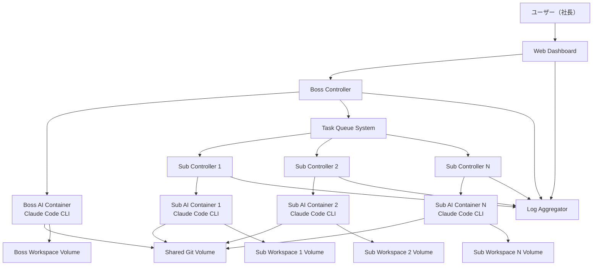

# Design Document

## Overview

Claude Company Systemは、WindowsホストのDocker環境上でLinuxコンテナを使用して動作する階層型AI開発システムです。各LinuxコンテナでClaude Code CLIを実行し、上司AI、部下AI、キューシステム、Webダッシュボードが連携してプロジェクト開発を自動化します。

## Architecture

### System Architecture Diagram



### Container Architecture

1. **Web Dashboard Container**
   - React.js + TypeScript フロントエンド
   - WebSocket接続でリアルタイム更新
   - ユーザー指示入力インターフェース

2. **Boss AI Container**
   - Ubuntu 22.04 LTS ベース
   - Claude Code CLI インストール済み
   - Node.js 20 LTS + 制御スクリプト
   - Python 3.11 + 制御スクリプト
   - タスク分解・割り振りロジック
   - 結合テスト実行環境
   - MCP (Model Context Protocol) 対応

3. **Subordinate AI Container(s)**
   - Ubuntu 22.04 LTS ベース
   - Claude Code CLI インストール済み
   - Node.js 20 LTS + 制御スクリプト
   - Python 3.11 + 制御スクリプト
   - 単体テスト実行環境
   - 開発ツール（Node.js, Python, Go等）

4. **Task Queue System**
   - Redis 7 + Bull Queue (Node.js)
   - タスクの優先度管理
   - 依存関係解決

5. **Shared Git Volume**
   - Docker Volume として共有
   - 各コンテナからマウント
   - 自動コミット・ブランチ管理

6. **Log Aggregator**
   - Fluent Bit + Elasticsearch + Kibana
   - リアルタイムログ収集・表示

## Components and Interfaces

### 1. Web Dashboard Component

**技術スタック:**
- Frontend: React 18 + TypeScript + Vite
- WebSocket: Socket.io-client
- UI Framework: Material-UI v5
- State Management: Zustand

**主要機能:**
- ユーザー指示入力フォーム
- AIエージェント状況表示
- リアルタイムログビューア
- プロジェクト進捗ダッシュボード

**API Endpoints:**
```typescript
interface DashboardAPI {
  // ユーザー指示送信
  POST /api/instructions
  
  // AIエージェント状況取得
  GET /api/agents/status
  
  // ログストリーム接続
  WebSocket /ws/logs
  
  // プロジェクト進捗取得
  GET /api/projects/{id}/progress
}
```

### 2. Boss AI Component

**技術スタック:**
- OS: Ubuntu 22.04 LTS
- Claude Code CLI: 最新版
- Controller: Node.js 20 LTS + TypeScript
- Runtime: Python 3.11
- Task Queue: Celery + Redis
- Testing: pytest + selenium (for frontend testing)
- MCP: Model Context Protocol client

**主要機能:**
- ユーザー指示の解析・タスク分解
- 部下AIへのタスク割り振り
- Claude Code CLIとの対話制御
- コードレビュー・結合テスト実行
- 進捗レポート生成

**クラス設計:**
```typescript
class BossController {
    private claudeProcess: ChildProcess;
    private taskQueue: TaskQueue;
    private gitManager: GitManager;
    
    async start_claude_session(): Promise<void> {
        /**Claude Code CLIセッションを開始*/
        this.claudeProcess = spawn('claude', [
            '--workspace', this.workspacePath,
            '--permission-mode', 'bypassPermissions',
            '--print'
        ]);
    }
    
    async process_user_instruction(instruction: string): Promise<Task[]> {
        /**ユーザー指示をタスクに分解*/
        const prompt = `以下の指示を具体的なタスクに分解してください: ${instruction}`;
        return await this.sendToClaudeCode(prompt);
    }
    
    async review_subordinate_work(workResult: WorkResult): Promise<ReviewResult> {
        /**部下の成果物をレビュー*/
        const prompt = `以下のコードをレビューしてください: ${workResult.code}`;
        return await this.sendToClaudeCode(prompt);
    }
    
    async run_integration_tests(projectPath: string): Promise<TestResult> {
        /**結合テストを実行*/
        const prompt = `${projectPath}で結合テストを実行してください`;
        return await this.sendToClaudeCode(prompt);
    }
    
    private async sendToClaudeCode(prompt: string): Promise<any> {
        return new Promise((resolve, reject) => {
            this.claudeProcess.stdin.write(prompt + '\n');
            // レスポンス処理
        });
    }
}
```

### 3. Subordinate AI Component

**技術スタック:**
- OS: Ubuntu 22.04 LTS
- Claude Code CLI: 最新版
- Controller: Node.js 20 LTS + TypeScript
- Runtime: Python 3.11
- Development Tools: Node.js, Python, Go, Docker
- Testing: pytest, jest, go test

**主要機能:**
- タスクの受信・実行
- Claude Code CLIとの対話制御
- コード生成・修正
- 単体テスト作成・実行
- 成果物の提出

**クラス設計:**
```typescript
class SubordinateController {
    private claudeProcess: ChildProcess;
    private agentId: string;
    private taskExecutor: TaskExecutor;
    
    async start_claude_session(): Promise<void> {
        /**Claude Code CLIセッションを開始*/
        this.claudeProcess = spawn('claude', [
            '--workspace', this.workspacePath,
            '--permission-mode', 'bypassPermissions',
            '--print'
        ]);
    }
    
    async execute_task(task: Task): Promise<WorkResult> {
        /**タスクを実行*/
        const prompt = `以下のタスクを実行してください: ${task.description}`;
        return await this.sendToClaudeCode(prompt);
    }
    
    async run_unit_tests(codePath: string): Promise<TestResult> {
        /**単体テストを実行*/
        const prompt = `${codePath}の単体テストを作成・実行してください`;
        return await this.sendToClaudeCode(prompt);
    }
    
    async submit_work(workResult: WorkResult): Promise<void> {
        /**成果物を提出*/
        await this.taskQueue.submitResult(workResult);
    }
    
    private async sendToClaudeCode(prompt: string): Promise<any> {
        return new Promise((resolve, reject) => {
            this.claudeProcess.stdin.write(prompt + '\n');
            // レスポンス処理
        });
    }
}
```

### 4. Task Queue System

**技術スタック:**
- Message Broker: Redis 7
- Task Queue: Bull Queue (Node.js)
- Serialization: JSON

**データモデル:**
```typescript
interface Task {
    id: string;
    title: string;
    description: string;
    priority: number;
    dependencies: string[];
    assignedTo?: string;
    status: TaskStatus;
    createdAt: Date;
    deadline?: Date;
}

interface WorkResult {
    taskId: string;
    agentId: string;
    codeChanges: CodeChange[];
    testResults: TestResult;
    completionTime: Date;
}
```

## Data Models

### 1. Project Model
```typescript
interface Project {
    id: string;
    name: string;
    description: string;
    repositoryPath: string;
    status: ProjectStatus;
    createdAt: Date;
    updatedAt: Date;
    tasks: Task[];
}
```

### 2. Agent Model
```typescript
interface Agent {
    id: string;
    type: AgentType; // BOSS | SUBORDINATE
    status: AgentStatus; // IDLE | WORKING | ERROR
    currentTask?: string;
    lastActivity: Date;
    performanceMetrics: Record<string, any>;
}
```

### 3. Test Result Model
```typescript
interface TestResult {
    testType: TestType; // UNIT | INTEGRATION
    passed: boolean;
    totalTests: number;
    passedTests: number;
    failedTests: number;
    executionTime: number;
    details: TestDetail[];
}
```

## Error Handling

### 1. Claude Code CLI Error Handling
- プロセス異常終了時の自動再起動
- 標準出力・標準エラーの監視
- タイムアウト処理（長時間応答なし）
- 認証エラーの処理

### 2. Container Error Handling
- ヘルスチェック機能
- 自動再起動設定
- リソース制限とOOM対策
- ボリュームマウントエラー対応

### 3. Task Queue Error Handling
- デッドレターキュー
- タスクタイムアウト処理
- 依存関係エラーの解決
- Redis接続エラー対応

### 4. Git Operation Error Handling
- マージコンフリクト自動解決
- コミット失敗時のロールバック
- ブランチ保護ルール
- 共有ボリュームの排他制御

## Testing Strategy

### 1. Unit Testing
- 各コントローラーのロジック単体テスト
- Claude Code CLI との通信テスト
- タスクキューの動作テスト

### 2. Integration Testing
- AIエージェント間の連携テスト
- Docker Compose環境での結合テスト
- WebSocket通信テスト

### 3. End-to-End Testing
- ユーザー指示から成果物完成までの全工程テスト
- 複数部下AIでの負荷分散テスト
- 障害復旧テスト

### 4. Performance Testing
- Claude Code CLI呼び出し最適化
- 同時タスク実行性能測定
- メモリ・CPU使用量監視

## Deployment Configuration

### Docker Compose Structure
```yaml
version: '3.8'
services:
  dashboard:
    build: ./dashboard
    ports:
      - "3000:3000"
    environment:
      - REACT_APP_API_URL=http://localhost:8000
    depends_on:
      - redis
  
  boss-controller:
    build: ./boss-controller
    environment:
      - ANTHROPIC_API_KEY=${ANTHROPIC_API_KEY}
      - REDIS_URL=redis://redis:6379
      - WORKSPACE_PATH=/workspace/boss
    volumes:
      - shared-git:/workspace/shared-git
      - boss-workspace:/workspace/boss
    depends_on:
      - redis
  
  subordinate-controller:
    build: ./subordinate-controller
    environment:
      - ANTHROPIC_API_KEY=${ANTHROPIC_API_KEY}
      - REDIS_URL=redis://redis:6379
      - WORKSPACE_PATH=/workspace/sub
      - AGENT_ID=${AGENT_ID}
    volumes:
      - shared-git:/workspace/shared-git
      - subordinate-workspace:/workspace/sub
    deploy:
      replicas: 3
    depends_on:
      - redis
  
  redis:
    image: redis:7-alpine
    ports:
      - "6379:6379"
    command: redis-server --appendonly yes
    volumes:
      - redis-data:/data
  
  elasticsearch:
    image: elasticsearch:8.8.0
    environment:
      - discovery.type=single-node
      - xpack.security.enabled=false
    volumes:
      - es-data:/usr/share/elasticsearch/data
  
  kibana:
    image: kibana:8.8.0
    ports:
      - "5601:5601"
    depends_on:
      - elasticsearch

volumes:
  shared-git:
  boss-workspace:
  subordinate-workspace:
  redis-data:
  es-data:
```

### Claude Code CLI Configuration

各コンテナでの Claude Code 設定:
```json
{
  "model": "claude-3-5-sonnet-20241022",
  "permission_mode": "bypassPermissions",
  "mcp_config": {
    "servers": {
      "browser": {
        "command": "npx",
        "args": ["@modelcontextprotocol/server-browser"]
      }
    }
  },
  "allowedTools": ["Bash", "Edit", "Create", "Delete"],
  "workspace": "/workspace"
}
```

## Security Considerations

### 1. API Key Management
- 環境変数での安全な管理
- コンテナ間での暗号化通信
- 定期的なキーローテーション

### 2. Container Isolation
- 最小権限の原則
- ネットワークセグメンテーション
- リソース制限設定
- 読み取り専用ファイルシステム

### 3. Code Security
- 生成コードの静的解析
- 依存関係の脆弱性チェック
- セキュアコーディング規約の適用
- サンドボックス環境での実行

### 4. Communication Security
- コンテナ間通信の暗号化
- Redis認証の有効化
- WebSocket接続のセキュリティ