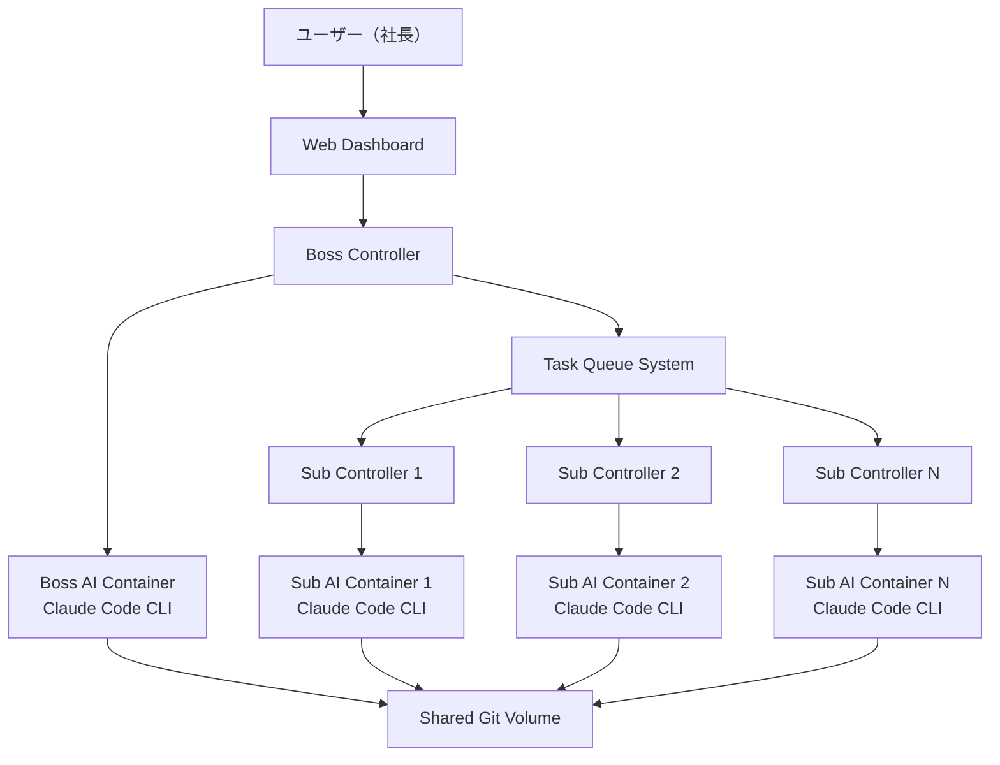

# Claude Company System

階層型AI開発システム - 上司AIと部下AIが協力してプロジェクト開発を自動化

## 概要

Claude Company Systemは、Windows環境のDocker上で動作する革新的な階層型AI開発システムです。上司役のClaude AIが部下役のClaude AIに指示を出し、ユーザー（社長）の指示のもとでプロジェクト開発を推進します。各AIエージェントは独立したDocker環境で動作し、テスト駆動開発とGitによるバージョン管理を自動で行います。

## 主な特徴

- 🏢 **階層型AI組織**: 上司AIが部下AIを管理する組織構造
- 🐳 **Docker完全対応**: 1つのコマンドで環境が起動
- 🔄 **リアルタイム監視**: WebダッシュボードでAIの作業状況を監視
- 🧪 **自動テスト**: 部下AIは単体テスト、上司AIは結合テストを実行
- 📊 **キューシステム**: 複数の部下AIに効率的にタスクを分散
- 🔒 **完全隔離**: ローカル環境に影響を与えない安全な実行環境
- 📝 **Git自動管理**: すべての成果物を自動でバージョン管理

## システム構成



## 前提条件

- Windows 10/11
- Docker Desktop for Windows
- Node.js 20 LTS以上
- Claude Code CLI（100ドルプラン）のAPIキー

## クイックスタート

### 1. リポジトリのクローン

```bash
git clone https://github.com/your-username/claude-company-system.git
cd claude-company-system
```

### 2. 環境変数の設定

`.env`ファイルを作成し、Claude APIキーを設定：

```env
ANTHROPIC_API_KEY=your_claude_api_key_here
```

### 3. システムの起動

```bash
# Windows PowerShell
.\start.ps1

# または Windows Command Prompt
start.bat
```

### 4. ダッシュボードにアクセス

ブラウザで http://localhost:3000 にアクセス

## 使用方法

### 基本的なワークフロー

1. **指示の入力**: Webダッシュボードから上司AIに指示を入力
2. **タスク分解**: 上司AIが指示を具体的なタスクに分解
3. **タスク分散**: キューシステムが部下AIにタスクを分散
4. **並行開発**: 複数の部下AIが並行してコード開発
5. **自動テスト**: 各部下AIが単体テストを実行
6. **統合・レビュー**: 上司AIがコードレビューと結合テストを実行
7. **Git管理**: 成果物を自動でGitにコミット・管理

### 指示の例

```
「Node.jsでREST APIを作成してください。ユーザー管理機能とタスク管理機能を含めてください。」

「Reactでタスク管理アプリのフロントエンドを作成してください。Material-UIを使用してください。」

「既存のAPIにユーザー認証機能を追加してください。JWTを使用してください。」
```

## アーキテクチャ

### コンテナ構成

| コンテナ | 役割 | 技術スタック |
|---------|------|-------------|
| **Web Dashboard** | ユーザーインターフェース | React 18 + TypeScript + Material-UI |
| **Boss AI** | 上司AI・タスク管理 | Ubuntu + Claude Code CLI + Node.js |
| **Subordinate AI** | 部下AI・コード開発 | Ubuntu + Claude Code CLI + Node.js |
| **Task Queue** | タスクキューシステム | Redis + Bull Queue |
| **Log Aggregator** | ログ収集・可視化 | Elasticsearch + Kibana |

### データフロー

1. **ユーザー指示** → Web Dashboard → Boss Controller
2. **タスク分解** → Boss AI (Claude Code CLI) → Task Queue
3. **タスク実行** → Subordinate AI (Claude Code CLI) → 成果物
4. **レビュー・統合** → Boss AI → 最終成果物
5. **Git管理** → 自動コミット・ブランチ管理

## 設定

### Claude Code CLI設定

各AIコンテナでの設定例：

```json
{
  "model": "claude-3-5-sonnet-20241022",
  "permission_mode": "bypassPermissions",
  "mcp_config": {
    "servers": {
      "browser": {
        "command": "npx",
        "args": ["@modelcontextprotocol/server-browser"]
      }
    }
  },
  "allowedTools": ["Bash", "Edit", "Create", "Delete"],
  "workspace": "/workspace"
}
```

### 環境変数

| 変数名 | 説明 | デフォルト値 |
|--------|------|-------------|
| `ANTHROPIC_API_KEY` | Claude APIキー | 必須 |
| `SUBORDINATE_REPLICAS` | 部下AIの数 | 3 |
| `REDIS_URL` | Redis接続URL | redis://redis:6379 |
| `LOG_LEVEL` | ログレベル | info |

## 監視とログ

### Webダッシュボード機能

- **リアルタイム状況表示**: 各AIエージェントの現在の作業状況
- **ログビューア**: リアルタイムでコマンド出力とログを表示
- **進捗ダッシュボード**: タスクの進捗状況を可視化
- **エラー監視**: システムエラーとスタックトレースの表示

### Kibanaダッシュボード

http://localhost:5601 でアクセス可能

- システム全体のログ分析
- パフォーマンス監視
- エラー傾向の分析

## トラブルシューティング

### よくある問題

#### 1. コンテナが起動しない

```bash
# Docker Desktopが起動しているか確認
docker --version

# ログを確認
docker-compose logs
```

#### 2. Claude APIエラー

```bash
# APIキーが正しく設定されているか確認
echo $ANTHROPIC_API_KEY

# コンテナ内でClaude CLIが動作するか確認
docker exec -it boss-ai claude --version
```

#### 3. メモリ不足

Docker Desktopのリソース設定を確認：
- メモリ: 最低8GB推奨
- CPU: 最低4コア推奨

### ログの確認

```bash
# 全体のログ
docker-compose logs -f

# 特定のサービスのログ
docker-compose logs -f boss-controller
docker-compose logs -f subordinate-controller
```

## 開発・カスタマイズ

### 開発環境のセットアップ

```bash
# 依存関係のインストール
npm install

# 開発モードで起動
npm run dev
```

### カスタマイズポイント

- **AIプロンプト**: `src/prompts/` でプロンプトテンプレートを編集
- **タスクキュー**: `src/queue/` でタスク処理ロジックを編集
- **UI**: `dashboard/src/` でWebインターフェースを編集

## 貢献

プルリクエストやイシューの報告を歓迎します。

### 開発ガイドライン

1. TypeScriptを使用
2. ESLintとPrettierでコード品質を保持
3. 単体テストを必ず作成
4. コミットメッセージは[Conventional Commits](https://conventionalcommits.org/)に従う

## ライセンス

MIT License - 詳細は[LICENSE](LICENSE)ファイルを参照

## サポート

- 📖 [ドキュメント](docs/)
- 🐛 [Issue報告](https://github.com/your-username/claude-company-system/issues)
- 💬 [ディスカッション](https://github.com/your-username/claude-company-system/discussions)

## ロードマップ

- [ ] v1.0: 基本機能の実装
- [ ] v1.1: パフォーマンス最適化
- [ ] v1.2: 追加言語サポート（Python、Go等）
- [ ] v2.0: クラウドデプロイメント対応
- [ ] v2.1: AI学習機能の追加

---

**Claude Company System** - AIが協力して開発する未来を、今すぐ体験してください。

